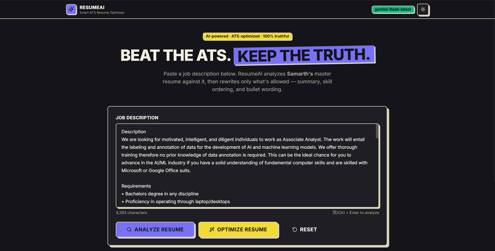
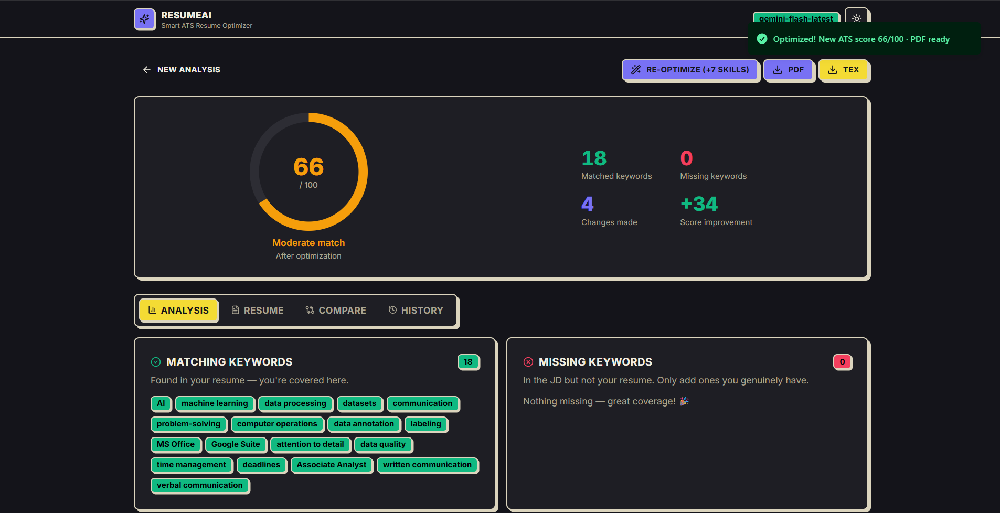
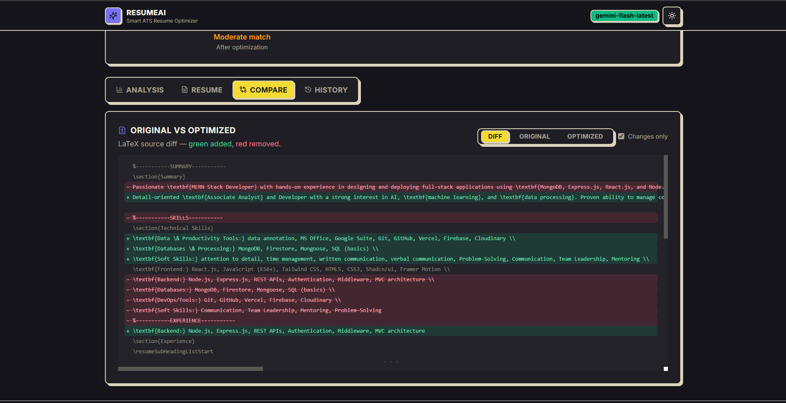

# ResumeAI — Smart ATS Resume Optimizer

**An AI-powered web app that tailors a master LaTeX resume to any job description — without ever lying.**

Paste a JD → get an ATS match score, keyword gap analysis, and a freshly compiled, JD-tailored PDF in seconds. The AI is *structurally incapable* of inventing experience: it can only rewrite, reorder, and rephrase what's already true.

> 🎯 **The core idea:** every resume-AI tool can inflate a resume. The hard problem is maximizing ATS score while *guaranteeing* truthfulness — enforced in code, not just in prompts.

<!-- SCREENSHOT: hero — home page with JD pasted -->


---

## ✨ Features

| | |
|---|---|
| **ATS Match Score** | Animated gauge, before/after comparison, deterministic rubric-based scoring |
| **Keyword Analysis** | Matched & missing keywords vs the JD, with synonym matching (React ≈ React.js) |
| **Skill Approval Flow** | Missing JD skills appear as tick-to-approve chips — only skills *you confirm* get added |
| **Keyword Heatmap** | Keyword × section frequency grid |
| **Skill Gap Analysis** | Missing skills ranked critical → nice-to-have, with honest suggestions |
| **Compare View** | Original vs optimized LaTeX, modified lines highlighted |
| **PDF Pipeline** | Server-side `pdflatex` compilation, in-app preview, PDF/TEX download |
| **Version History** | Every optimization run saved and retrievable |
| **UI** | Neobrutalist design system, dark mode, Framer Motion, fully responsive |

<!-- SCREENSHOT: analysis view with score ring + skill approval chips -->


<!-- SCREENSHOT: compare view + pdf preview side by side (or two images) -->


---

## 🔒 How the truth-locking works

This is the interesting engineering problem. LLMs *want* to please — ask one to "optimize a resume for this JD" and it will happily invent Kubernetes experience. ResumeAI prevents this with **four independent layers**:

```
┌─────────────────────────────────────────────────────────────┐
│ 1. PROMPT LAYER    system prompts forbid invention;         │
│                    truthfulness explicitly outranks score   │
├─────────────────────────────────────────────────────────────┤
│ 2. STRUCTURAL      the LaTeX modifier can only splice into  │
│    LAYER           summary / skills / bullets — education,  │
│                    dates, employers are UNREACHABLE by code │
├─────────────────────────────────────────────────────────────┤
│ 3. SANITIZER       optimized skills are validated against   │
│    LAYER           the original list — unknown skills are   │
│                    dropped, dropped originals re-appended.  │
│                    The AI cannot add or lose a skill.       │
├─────────────────────────────────────────────────────────────┤
│ 4. HUMAN LAYER     missing JD skills become approval chips; │
│                    only user-confirmed skills pass the      │
│                    sanitizer whitelist                      │
└─────────────────────────────────────────────────────────────┘
```

Even if the model hallucinates, layers 2–3 make fabrication *mechanically impossible*: the modifier performs index-based splices on the original source, so the preamble, fonts, dates, and employers are byte-for-byte identical in the output.

**Scoring accuracy** is handled the same way — trust code over model vibes. The ATS score is a fixed weighted rubric (45% required skills, 25% ATS keywords, 15% responsibilities, 10% preferred, 5% soft skills) computed in code from the model's own keyword extraction, blended with the model's estimate, at `temperature: 0`. Same resume + JD → same score.

---

## 🏗️ Architecture

```
                       ┌──────────────┐
  Job Description ───► │  React SPA   │  Vite · Tailwind · Framer Motion
                       └──────┬───────┘
                              │ REST
                       ┌──────▼───────┐
                       │   Express    │  /analyze · /optimize · /versions
                       └──────┬───────┘
              ┌───────────────┼────────────────┐
        ┌─────▼─────┐   ┌─────▼──────┐   ┌─────▼─────┐
        │ LaTeX     │   │ AI Service │   │ pdflatex  │
        │ parser /  │   │ (OpenAI-   │   │ compiler  │
        │ modifier  │   │ compatible)│   │ (2-pass)  │
        └───────────┘   └────────────┘   └───────────┘
```

- **`/templates/resume.tex`** — master resume, single source of truth, never modified
- **`server/parser/`** — index-preserving LaTeX → JSON parser + surgical splice-back modifier
- **`server/prompts/`** — all prompts live as files, nothing hardcoded
- **`server/services/aiService.js`** — provider-agnostic (OpenAI / Gemini / any OpenAI-compatible endpoint), with response normalization defensive against model drift
- **Mock mode** — no API key? A deterministic lexicon-based analyzer keeps the whole app demonstrable offline

## 🧰 Tech Stack

**Frontend:** React 18 · Vite · Tailwind CSS · shadcn-style components · Framer Motion · sonner
**Backend:** Node.js · Express
**AI:** any OpenAI-compatible API (Gemini, OpenAI, OpenRouter…) with deterministic offline fallback
**PDF:** pdflatex (MiKTeX / TeX Live), 2-pass compile with timeout & cleanup

---

## 🚀 Getting Started

**Prerequisites:** Node.js ≥ 18 · pdflatex *(optional — app degrades to .tex download)* · an API key *(optional — mock mode without one)*

```bash
# 1. install
npm install && npm run install:all

# 2. configure
cp server/.env.example server/.env
#    → add your API key, or leave empty for offline mock mode

# 3. run (server :5050 + client :5173)
npm run dev
```

Open **http://localhost:5173**, paste a job description, and click **Optimize**.

<details>
<summary><b>Environment variables</b></summary>

| Variable | Default | Description |
|---|---|---|
| `PORT` | `5050` | API port |
| `OPENAI_API_KEY` | *(empty)* | Empty → mock mode |
| `OPENAI_MODEL` | `gpt-5.5` | Any chat-completions model |
| `OPENAI_BASE_URL` | *(empty)* | Gemini: `https://generativelanguage.googleapis.com/v1beta/openai/` |
| `PDFLATEX_PATH` | `pdflatex` | Full path if not on PATH (see `.env.example` for Windows/MiKTeX) |
| `PDFLATEX_TIMEOUT_MS` | `60000` | Compile timeout |

</details>

<details>
<summary><b>API reference</b></summary>

| Method | Route | Description |
|---|---|---|
| `GET` | `/api/resume` | Parsed master resume + raw tex |
| `POST` | `/api/analyze` | `{ jobDescription }` → analysis + heatmap |
| `POST` | `/api/optimize` | `{ jobDescription, analysis?, approvedSkills? }` → optimization + PDF |
| `GET` | `/api/download/pdf` \| `/tex` | Download outputs |
| `GET` | `/api/preview/pdf` | Inline PDF for the preview iframe |
| `GET` | `/api/versions` \| `/:id` | Version history |
| `GET` | `/api/health` | Mode, model, pdflatex availability |

</details>

## ✅ What the AI may / may not change

| ✅ May optimize | ❌ Never touches |
|---|---|
| Professional summary | Education |
| Skills ordering & grouping | Dates |
| Project descriptions (bullets) | Company names |
| Achievement wording | Project & certification names |
| User-approved skill additions | CGPA / contact info |

## 🔁 Bring your own resume

Swap `/templates/resume.tex` with any resume using the same command conventions (`\section`, `\resumeSubheading`, `\resumeProjectHeading`, `\resumeItem`, `\textbf{Category:} skills` lines) and everything keeps working.

---

*Built with the conviction that an ATS-optimized resume and an honest resume should be the same document.*
